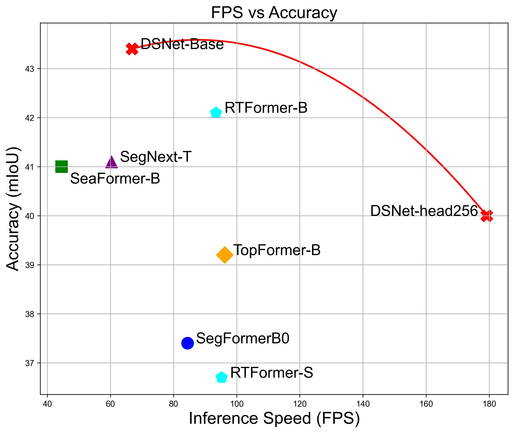
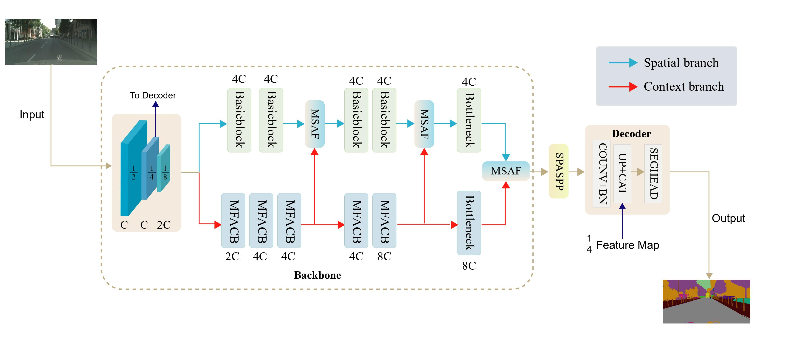
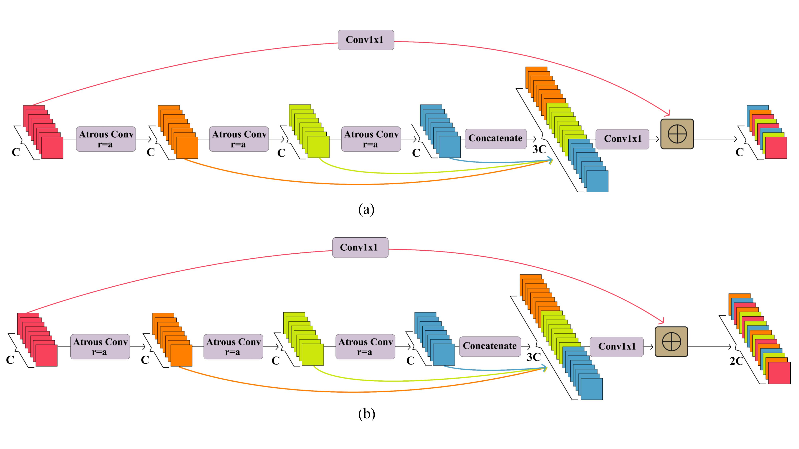
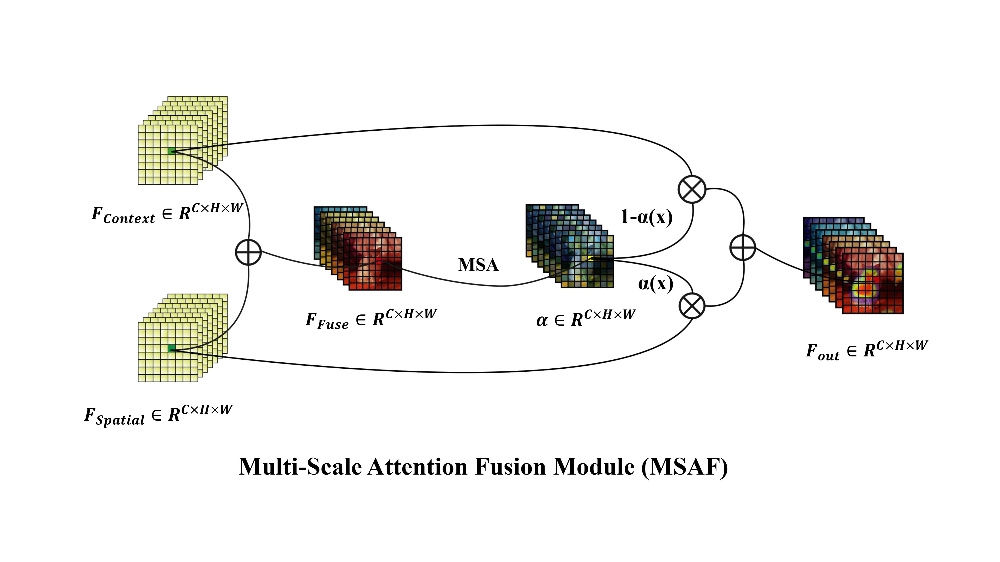

# DSNet：A Novel Way to Use Atrous Convolutions in Semantic Segmentation
a novel real-time model in semantic segmentation. Paper: ([PDF]https://arxiv.org/abs/2406.03702))
[](https://paperswithcode.com/sota/real-time-semantic-segmentation-on-cityscapes-1?p=dsnet-a-novel-way-to-use-atrous-convolutions) [](https://paperswithcode.com/sota/semantic-segmentation-on-camvid?p=dsnet-a-novel-way-to-use-atrous-convolutions) [](https://paperswithcode.com/sota/semantic-segmentation-on-cityscapes-val?p=dsnet-a-novel-way-to-use-atrous-convolutions)


This is the implementation for DSNet. This paper was accepted by CVPR 2024 Workshop on Computer Vision in the Wild. DSNetV2 is currently under development... DSNetV2 will offer a better balance between speed and accuracy, as well as a more comprehensive DSNet family ranging from small to large models.


## **Environment**: 
PyTroch 1.10 

python 3.8

4\*RTX4090 or 8\*RTX4090 
      
      pip install -r requirements.txt

## **Highlight**
<table border="0">
<tr>
    <td>
        <figure>
            
            <figcaption style="text-align: center;">Params vs mIOU on Cityscapes val set</figcaption>
        </figure>
    </td>
    <td>
        <figure>
            
            <figcaption > ADE20K</figcaption>
        </figure>
    </td>
</tr>
</table>

• We revisited the design of atrous convolutions in CNNs,and explored three empirical guidelines for atrous convolution. Based on the above guidelines, we proposed a novel Dual-branch network.

• DSNet achieves a new state-of-the-art trade-off between accuracy and speed on ADE20K, Cityscapes,and BDD10K. 


## **Overview**: 
<p align="center">
  </br>
  <span align="center">An overview of the basic architecture of our proposed DSNet. </span> 
</p>

<p align="center">
  </br>
  <span align="center">Diagram of Multi-Scale Fusion Atrous Convolutional Block (MFACB). </span> 
</p>

<table border="0">
<tr>
    <td>
        <figure>
            
        </figure>
    </td>
    <td>
        <figure>
            
        </figure>
    </td>
</tr>
</table>

## **Train and Inference speed**:
This implementation is based on [HRNet-Semantic-Segmentation](https://github.com/HRNet/HRNet-Semantic-Segmentation) and [PIDNet](https://github.com/XuJiacong/PIDNet). Please refer to their repository for installation and dataset preparation. The inference speed is tested on single RTX 3090 or RTX4090. BDD10K has not been implemented in the above link. The dataset storage format is as follows. Download link: [web page](https://bdd-data.berkeley.edu/)

- bdd
  - seg
    - color_labels
      - train
      - val
    - images
      - train
      - val
      - test
    - labels
      - train
      - val

### Train
```
python -m torch.distributed.launch --nproc_per_node=4 DSNet/tools/train.py
```

### Inference speed
```
python DSNet/models/speed/dsnet_speed.py
```

## Citation

If you think this work is useful, please cite our paper:
```
@misc{guo2024dsnet,
      title={DSNet: A Novel Way to Use Atrous Convolutions in Semantic Segmentation}, 
      author={Zilu Guo and Liuyang Bian and Xuan Huang and Hu Wei and Jingyu Li and Huasheng Ni},
      year={2024},
      eprint={2406.03702},
      archivePrefix={arXiv},
      primaryClass={cs.CV}
}
```

## Weight
### DSNet-Base:
  
  DSNet_Base_imagenet：[ Baidu drive](https://pan.baidu.com/s/1acGfjtF1eHb3hNxyHcsJTA?pwd=a123) ,[google drive](https://drive.google.com/file/d/1LqmgL4thNJFcMWRYaXJUFNTy2y5FvZ8E/view?usp=sharing)
  
  ADE20K: 43.44%mIOU: [ Baidu drive](https://pan.baidu.com/s/1TKBFtCj6gwMq97NjYsmPOQ?pwd=a123), [google drive](https://drive.google.com/file/d/1hr9BlqgI4t4djibyj1fCW2LTMvlFFDWP/view?usp=sharing)
  
  BDD10K: 64.6%mIOU： [ Baidu drive](https://pan.baidu.com/s/13Hvi6he0hZgciff7tBUo0A?pwd=a123), [google drive]( https://drive.google.com/file/d/1IqMornjPHMVYHWdGhl-Jr1J4FvcZotoj/view?usp=sharing)
                      
  Camvid(pretrained on Cityscapes train set): 83.32%mIOU: [ Baidu drive](https://pan.baidu.com/s/1Q-e-_s-vsgn14S8GoBoTlA?pwd=a123), [google drive](https://drive.google.com/file/d/141889Jei9rcgJ9wSiFF8rNvUDUiV8SqI/view?usp=sharing)           

  Cityscapes : 82.0%mIOU:[google drive](https://drive.google.com/file/d/17SpPO3tsusB9JngjfnJFWzxffCoQRc9z/view?usp=sharing)
### DSNet:

  DSNet_imagenet: [ Baidu drive](https://pan.baidu.com/s/1wMPH5ZNKwHIyFJ6Pp9-n2w?pwd=a123), [google drive](https://drive.google.com/file/d/1Cb3nd69IjQjjK_r8jXSMON4cHQ76MWbR/view?usp=sharing)
  
  ADE20k 40.0%mIOU: [ Baidu drive](https://pan.baidu.com/s/17CH66GTI2YEXMq7eXnK0xQ?pwd=a123), [google drive](https://drive.google.com/file/d/1J-qf5blQ71HGy4EStqMMg-NT1sO1CyUV/view?usp=sharing)
  
  BDD10K 62.8%mIOU: [ Baidu drive](https://pan.baidu.com/s/1tPQHC1LTE6tlueXvabU1-Q?pwd=a123), [google drive](https://drive.google.com/file/d/192T2dauq_cA1bBkmiRwYKWdYw27lxZIG/view?usp=sharing)

  Cityscapes: 80.4%mIOU:[google drive](https://drive.google.com/file/d/1UmG7qaMz9BXR4hXxvIoJJ9k_N9JVuUQy/view?usp=sharing)

